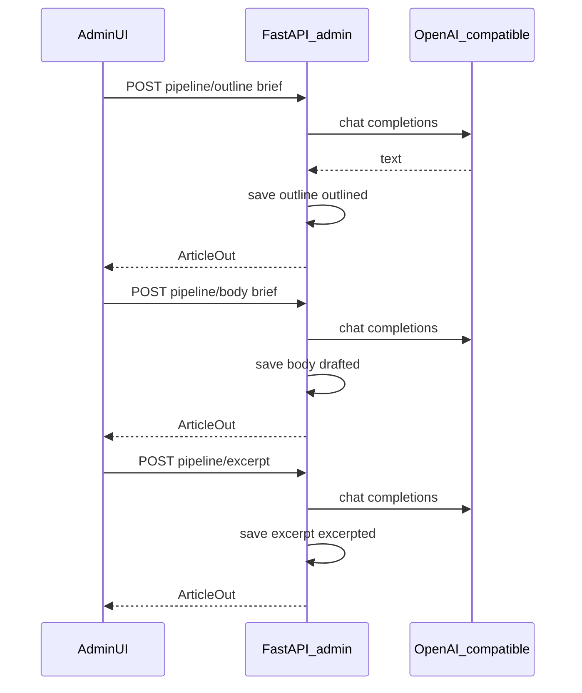

# 文章生产流水线 — 实现说明

本文档描述 ArtPro 官网 monorepo 中 **文章 AI 生产流水线** 的实现细节，与 PRD（[`艺考官网-需求说明.md`](艺考官网-需求说明.md)）中的统一响应包、管理端鉴权约定一致。

## 1. 目标与范围

- **目标**：在管理端对单篇文章依次完成「生成大纲 → 根据大纲生成正文 → 根据正文生成摘要」，减轻运营录入压力；生成结果落库，**必须人工校对后再发布**。
- **公开站点**：`/api/v1/articles` 列表与详情 **不返回** `outline`、`pipeline_stage`（实现见 [`apps/api/app/api/v1/content.py`](../apps/api/app/api/v1/content.py) 手工拼装字段，未扩展）。
- **有意未实现**（MVP 外）：流式 SSE、多版本草稿表、审核工作流、RAG、流水线专用限流。

## 2. 数据模型与迁移

### 2.1 表 `articles` 新增列

| 列 | 类型 | 说明 |
|----|------|------|
| `outline` | `TEXT`，可空 | Markdown 大纲，仅管理端可见与编辑 |
| `pipeline_stage` | `VARCHAR(32)`，非空，默认 `idle` | 流水线阶段标记，见下表 |

### 2.2 `pipeline_stage` 取值

应用层合法值（写入 `create`/`update` 时若非法则规范为 `idle`）：

| 值 | 含义 |
|----|------|
| `idle` | 尚未通过流水线生成或未标记 |
| `outlined` | 已调用「生成大纲」并成功保存 |
| `drafted` | 已调用「生成正文」并成功保存 |
| `excerpted` | 已调用「生成摘要」并成功保存 |

### 2.3 Alembic

- 版本链：`0003` → **`0004`**
- 脚本：[apps/api/alembic/versions/20260509_0004_article_pipeline.py](../apps/api/alembic/versions/20260509_0004_article_pipeline.py)
- 部署命令（在 `apps/api` 下）：

```bash
alembic upgrade head
```

## 3. 配置与环境变量

配置类：[apps/api/app/config.py](../apps/api/app/config.py)（`pydantic-settings`，支持仓库根 `.env` 与 `apps/api/.env`）。

| 环境变量 | 说明 | 默认 |
|----------|------|------|
| `OPENAI_API_KEY` | 未设置或为空时，流水线接口返回 **503**，业务码见下文 | 空 |
| `OPENAI_BASE_URL` | OpenAI 兼容 API 根路径 | `https://api.openai.com/v1` |
| `OPENAI_MODEL` | 对话模型名 | `gpt-4o-mini` |

国内中转或兼容网关可将 `OPENAI_BASE_URL` 指向相应 `/v1` 前缀地址。

## 4. 后端模块

### 4.1 依赖

- [`apps/api/requirements.txt`](../apps/api/requirements.txt) 增加 **`httpx`**，用于异步调用大模型 HTTP 接口。

### 4.2 LLM 客户端

- 文件：[apps/api/app/services/llm_openai.py](../apps/api/app/services/llm_openai.py)
- 行为：`POST {OPENAI_BASE_URL}/chat/completions`，解析 `choices[0].message.content`。
- 异常：
  - `LLMUnavailableError`：无有效 API Key。
  - `LLMUpstreamError`：HTTP 非 2xx、超时、或响应 JSON 结构异常。

### 4.3 流水线提示与步骤

- 文件：[apps/api/app/services/article_pipeline.py](../apps/api/app/services/article_pipeline.py)
- 函数：`generate_outline(article, brief)`、`generate_body(article, brief)`、`generate_excerpt(article)`。
- 语境：丝育教育 / 美术艺考；提示中约束勿编造具体分数线、录取率等除非用户材料写明；可对模型输出去除外层 Markdown 代码围栏。

### 4.4 Schema

- 文件：[apps/api/app/schemas/article.py](../apps/api/app/schemas/article.py)
- `ArticleOut` / `ArticleCreate` / `ArticleUpdate` 包含 `outline`、`pipeline_stage`。
- `ArticlePipelineBrief`：`brief: str`，默认 `""`，最大长度 8000，用于 `outline`/`body` 步骤的可选补充说明。

### 4.5 错误码

- 文件：[apps/api/app/core/errors.py](../apps/api/app/core/errors.py)
- `E_AI_UNAVAILABLE = 100503`：未配置大模型（如无 `OPENAI_API_KEY`），与 HTTP **503** 搭配使用。

## 5. 管理端 HTTP API

前缀：`/api/v1/admin`；均需 **Bearer JWT**（与其它管理接口相同）。

通用响应包：`{ "code", "message", "data" }`；成功 `code === 0`。

### 5.1 既有文章 CRUD 扩展

- `POST /admin/articles`：可创建时带入 `outline`、`pipeline_stage`（可选，阶段非法时规范为 `idle`）。
- `PUT /admin/articles/{article_id}`：可更新 `outline`、`pipeline_stage`；便于前端「保存」时持久化人工修改后的大纲。

### 5.2 流水线专用接口

| 方法 | 路径 | 请求体 | 行为 |
|------|------|--------|------|
| POST | `/admin/articles/{article_id}/pipeline/outline` | `{ "brief": "可选" }` | 调用模型生成大纲 → 写入 `outline`，`pipeline_stage=outlined` |
| POST | `/admin/articles/{article_id}/pipeline/body` | `{ "brief": "可选" }` | 按当前 `outline` 与标题生成 Markdown 正文 → 写入 `body`，`pipeline_stage=drafted` |
| POST | `/admin/articles/{article_id}/pipeline/excerpt` | 无（可发送空 JSON `{}`） | 根据正文生成摘要 → 写入 `excerpt`（截断至 schema 上限），`pipeline_stage=excerpted` |

成功时 `data` 为完整文章对象（`ArticleOut` 序列化）。

### 5.3 流水线错误响应

| 场景 | HTTP | `code` | 说明 |
|------|------|--------|------|
| 未配置 API Key | 503 | `100503` (`E_AI_UNAVAILABLE`) | 文案提示配置 `OPENAI_API_KEY` |
| 模型上游失败 | 502 | `500001` (`E_INTERNAL`) | 附简要错误信息 |
| 生成摘要但正文为空 | 422 | `100001` (`E_VALIDATION`) | 「正文为空，无法生成摘要」 |

实现位置：[apps/api/app/api/v1/admin.py](../apps/api/app/api/v1/admin.py)（`article_pipeline_outline` / `body` / `excerpt`）。

## 6. 前端（Next.js 管理端）

**入口位置（重要）**：流水线 **只出现在已创建文章的编辑页**，路径为 `/admin/articles/{文章UUID}`。需先 **登录管理端** → 侧栏 **文章管理** → 列表中点击某条 **「编辑」**，在页面标题 **下方** 可见紫色区块 **「AI 生产流水线」**。列表页与新建页不展示该区块（新建保存后会跳转到编辑页）。

- **编辑页**：[apps/web/app/(admin)/admin/articles/[id]/page.tsx](../apps/web/app/(admin)/admin/articles/[id]/page.tsx)
  - 「AI 生产流水线」区块：补充说明、`1/2/3` 三步按钮、可编辑大纲。
  - 保存表单时 `PUT` 携带 `outline`（与标题、slug、正文、摘要、发布时间一并提交）。
  - API 调用封装：[apps/web/lib/adminApi.ts](../apps/web/lib/adminApi.ts) 的 `adminFetch`。
- **列表页**：[apps/web/app/(admin)/admin/articles/page.tsx](../apps/web/app/(admin)/admin/articles/page.tsx)
  - 当 `pipeline_stage` 非 `idle` 时展示阶段文案（已出大纲 / 已出正文 / 已出摘要）。

## 7. 测试

- 文件：[apps/api/tests/test_v1.py](../apps/api/tests/test_v1.py)
- 覆盖要点：
  - 流水线接口未带 Token → **401**
  - 创建文章后调用 `pipeline/outline` 且无 `OPENAI_API_KEY`（`monkeypatch` + `get_settings.cache_clear()`）→ **503** 且 `code == E_AI_UNAVAILABLE`

在 `apps/api` 下执行：

```bash
uv run pytest tests/test_v1.py -q
```

## 8. 运维检查清单

1. 执行数据库迁移：`cd apps/api && alembic upgrade head`
2. 配置 `OPENAI_API_KEY`（及按需的 `OPENAI_BASE_URL`、`OPENAI_MODEL`）
3. 重启 API 进程，确认管理端登录后编辑页可调用三步接口
4. 发布后仍通过 `published_at` 控制对外可见性；流水线不改变既有「草稿 / 已发布」语义

## 9. 相关文件索引

| 路径 | 说明 |
|------|------|
| `apps/api/app/models/article.py` | ORM：`outline`、`pipeline_stage` |
| `apps/api/app/schemas/article.py` | Pydantic：`ArticlePipelineBrief` 等 |
| `apps/api/app/api/v1/admin.py` | CRUD 扩展与三条 `pipeline` 路由 |
| `apps/api/app/services/llm_openai.py` | OpenAI 兼容 Chat Completions |
| `apps/api/app/services/article_pipeline.py` | 提示词与三步生成 |
| `apps/api/app/config.py` | `OPENAI_*` 配置 |
| `apps/api/app/core/errors.py` | `E_AI_UNAVAILABLE` |
| `apps/api/alembic/versions/20260509_0004_article_pipeline.py` | 迁移 |
| `apps/web/app/(admin)/admin/articles/[id]/page.tsx` | 编辑页流水线 UI |
| `apps/web/app/(admin)/admin/articles/page.tsx` | 列表阶段展示 |

## 10. 流程示意（时序）



---

| 版本 | 日期 | 说明 |
|------|------|------|
| 0.1.0 | 2026-05-09 | 首版：与当前代码实现同步 |
