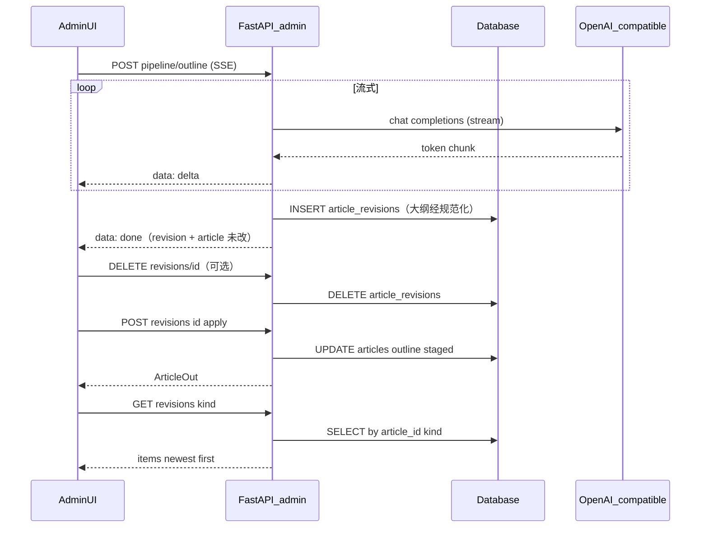

# 文章生产流水线 — 实现说明

本文档描述 ArtPro 官网 monorepo 中 **文章 AI 生产流水线** 的实现细节，与 PRD（[`艺考官网-需求说明.md`](艺考官网-需求说明.md)）中的统一响应包、管理端鉴权约定一致。

## 1. 目标与范围

- **目标**：在管理端对单篇文章依次完成「生成大纲 → 根据大纲生成正文 → 根据正文生成摘要」；**生成结果先写入修订表**，用户 **采用** 后再写入正式字段，避免误覆盖；**必须人工校对后再发布**。
- **公开站点**：`/api/v1/articles` 列表与详情 **不返回** `outline`、`pipeline_stage`，亦不返回 `article_revisions`（实现见 [`apps/api/app/api/v1/content.py`](../apps/api/app/api/v1/content.py)）。
- **已实现扩展**：三步 pipeline 成功路径为 **SSE 流式**（`delta` + `done`）；大纲落库前 **标题层级规范化**；`article_revisions` 支持 **手动删除** 与 **按保留时长自动清理**（默认超过 24 小时删除，进程内每 24 小时执行一轮）。
- **仍属范围外**：审核工作流、RAG、流水线专用限流等（与 PRD 预留一致时可另起文档）。

## 2. 数据模型与迁移

### 2.1 表 `articles` 新增列

| 列 | 类型 | 说明 |
|----|------|------|
| `outline` | `TEXT`，可空 | Markdown 大纲，仅管理端可见与编辑 |
| `pipeline_stage` | `VARCHAR(32)`，非空，默认 `idle` | 流水线阶段标记，见下表 |

### 2.2 `pipeline_stage` 取值

表示 **最近一次「采用」修订后** 的阶段（未经采用的生成**不会**更新本字段）。应用层合法值（`create`/`update` 时非法则规范为 `idle`）：

| 值 | 含义 |
|----|------|
| `idle` | 尚未采用过任一大纲/正文/摘要修订（或未标记） |
| `outlined` | 已采用过一版 `kind=outline` 的修订 |
| `drafted` | 已采用过一版 `kind=body` 的修订 |
| `excerpted` | 已采用过一版 `kind=excerpt` 的修订 |

### 2.3 表 `article_revisions`（第二版）

每次调用三步生成接口成功时 **INSERT** 一行快照；**不修改** `articles` 正式字段。

| 列 | 类型 | 说明 |
|----|------|------|
| `id` | UUID | 主键 |
| `article_id` | UUID | FK → `articles.id`，`ON DELETE CASCADE` |
| `kind` | `VARCHAR(16)` | `outline` \| `body` \| `excerpt` |
| `content` | `TEXT` | 该次生成全文 |
| `source` | `VARCHAR(32)` | 默认 `ai` |
| `created_at` | `timestamptz` | 创建时间 |

索引：`(article_id, kind, created_at)`。ORM：[apps/api/app/models/article_revision.py](../apps/api/app/models/article_revision.py)。

### 2.4 Alembic

- 版本链：`0003` → `0004`（`articles` 扩展）→ **`0005`**（`article_revisions`）
- 脚本：[0004](../apps/api/alembic/versions/20260509_0004_article_pipeline.py)、[0005](../apps/api/alembic/versions/20260509_0005_article_revisions.py)

```bash
cd apps/api && alembic upgrade head
```

### 2.5 （已合并）原 2.3 迁移说明

`0004` 仍为 `articles` 增加 `outline`、`pipeline_stage`，见上表 2.1。

## 3. 配置与环境变量

配置类：[apps/api/app/config.py](../apps/api/app/config.py)（`pydantic-settings`，支持仓库根 `.env` 与 `apps/api/.env`）。

**默认对接 [小米 MiMo](https://platform.xiaomimimo.com/docs/zh-CN/api/chat/openai-api)**（OpenAI 兼容 `POST .../chat/completions`，`Authorization: Bearer <API Key>`）。基址与模型默认值已按 MiMo 平台约定配置，仍可通过环境变量改用 OpenAI 或其它兼容网关。

| 环境变量 | 说明 | 默认 |
|----------|------|------|
| `MIMO_API_KEY` | 小米 MiMo 控制台 API Key；与 `OPENAI_API_KEY` **二选一**（代码中 `OPENAI_API_KEY` 优先） | 空 |
| `OPENAI_API_KEY` | 通用兼容平台 Key；未设时回退读取 `MIMO_API_KEY` | 空 |
| `OPENAI_BASE_URL` | 兼容 OpenAI 的 API 根路径（须可拼接 `/chat/completions`） | `https://api.xiaomimimo.com/v1` |
| `OPENAI_MODEL` | 模型 id | `xiaomi/mimo-v2-flash` |

其它常用 MiMo 模型（若平台文档有更新以控制台为准）：`xiaomi/mimo-v2-pro`、`xiaomi/mimo-v2-omni`。

**仅用 OpenAI 时**：设置 `OPENAI_API_KEY`，并将 `OPENAI_BASE_URL` 改为 `https://api.openai.com/v1`，`OPENAI_MODEL` 改为如 `gpt-4o-mini`。

**文章 AI 修订历史（`article_revisions`）清理**（实现见 [`apps/api/app/services/article_revision_cleanup.py`](../apps/api/app/services/article_revision_cleanup.py)，由 [`apps/api/app/main.py`](../apps/api/app/main.py) 的 `lifespan` 启动后台任务）：

| 环境变量 | 说明 | 默认 |
|----------|------|------|
| `ARTICLE_REVISION_CLEANUP_ENABLED` | 是否启动进程内定时清理任务；**pytest** 下由 [`tests/conftest.py`](../apps/api/tests/conftest.py) 设为 `false` | `true` |
| `ARTICLE_REVISION_RETENTION_HOURS` | `created_at` 早于此刻的记录将被删除 | `24` |
| `ARTICLE_REVISION_CLEANUP_INTERVAL_SECONDS` | 两次清理之间的休眠间隔（秒） | `86400`（24 小时） |

仓库根 [`.env.example`](../.env.example) 中有上述变量的注释示例。

## 4. 后端模块

### 4.1 依赖

- [`apps/api/requirements.txt`](../apps/api/requirements.txt) 增加 **`httpx`**，用于异步调用大模型 HTTP 接口。

### 4.2 LLM 客户端

- 文件：[apps/api/app/services/llm_openai.py](../apps/api/app/services/llm_openai.py)
- 行为：`POST {OPENAI_BASE_URL}/chat/completions`，解析 `choices[0].message.content`。
- 异常：
  - `LLMUnavailableError`：无有效 API Key。
  - `LLMUpstreamError`：HTTP 非 2xx、超时、或响应 JSON 结构异常。

### 4.3 流水线提示与步骤

- 文件：[apps/api/app/services/article_pipeline.py](../apps/api/app/services/article_pipeline.py)
- **非流式**（若其它代码路径仍调用）：`generate_outline`、`generate_body`、`generate_excerpt`。
- **流式（管理端 pipeline）**：`stream_outline_deltas`、`stream_body_deltas`、`stream_excerpt_deltas`，经 [`llm_openai.chat_completion_stream`](../apps/api/app/services/llm_openai.py) 输出增量。
- 语境：丝育教育 / 美术艺考；提示中约束勿编造具体分数线、录取率等除非用户材料写明；**正文/摘要** 可对模型输出去除外层 Markdown 代码围栏；**大纲** 在 `_strip_outer_code_fence` 之后另作层级规范化（见下）。
- **大纲标题铁律**（提示词 `SYS_OUTLINE_RULES` + 用户提示 `_outline_user`）：全篇仅允许 **一行** `##` 总标题，其余章节须为 `###`；当上下文含「当前已保存大纲」时，明确禁止照搬多组 `##` 并列版式。温度约 **0.25**，减轻重复生成时版式漂移。
- **`_normalize_outline_markdown`**：落库 / `done.revision.content` 前对整段大纲再处理——仅首个 `##`（或首行 `#`）保留为总标题，其后所有 `##` 降为 `###`，`####` 及以上压为 `###`。**注意**：SSE 过程中的 `delta` 帧仍为 **模型原文**；以流结束后的修订内容或「最新生成」展示为准（管理端文案已提示）。

### 4.4 Schema

- 文件：[apps/api/app/schemas/article.py](../apps/api/app/schemas/article.py)
- `ArticleOut` / `ArticleCreate` / `ArticleUpdate` 包含 `outline`、`pipeline_stage`。
- `ArticlePipelineBrief`：`brief: str`，默认 `""`，最大长度 8000，用于 `outline`/`body` 步骤的可选补充说明。
- `ArticleRevisionOut`：修订快照序列化；常量 `REVISION_KINDS` 用于校验 `kind`。

### 4.5 修订与正式内容的业务规则

- [`article_pipeline.py`](../apps/api/app/services/article_pipeline.py) 中 **`generate_*` 仅读取内存中 `Article` 实体的正式字段**（与数据库中当前已提交行一致）。**未采用的修订内容不会自动进入** 下一次生成的 prompt。
- **生成正文**：依赖正式字段 `outline`（及标题等）。运营需先 **采用** 大纲修订，或在表单中填写正式大纲并 **保存**。
- **生成摘要**：依赖正式字段 `body`（须非空）。需先 **采用** 正文修订或保存正式正文。

### 4.6 修订历史清理（定时 + 手动）

- **定时**：后台协程按配置的间隔调用 `purge_expired_article_revisions()`，删除 `created_at` 早于「当前 UTC − 保留小时数」的全部修订（**不限定** `article_id`，全库扫描）。
- **手动**：`DELETE /admin/articles/{article_id}/revisions/{revision_id}`，校验修订归属后物理删除一行；**不影响** 已写入 `articles` 的正式 `outline` / `body` / `excerpt`。
- **多副本部署**：每进程各跑一条清理循环，语义仍为幂等删除过期行；若需全局单一调度，可改为外置 Cron / 任务队列（未做）。

### 4.7 错误码

- 文件：[apps/api/app/core/errors.py](../apps/api/app/core/errors.py)
- `E_AI_UNAVAILABLE = 100503`：未配置大模型（`OPENAI_API_KEY` 与 `MIMO_API_KEY` 均为空），与 HTTP **503** 搭配使用。

## 5. 管理端 HTTP API

前缀：`/api/v1/admin`；均需 **Bearer JWT**（与其它管理接口相同）。

通用响应包：`{ "code", "message", "data" }`；成功 `code === 0`。

### 5.1 既有文章 CRUD 扩展

- `POST /admin/articles`：可创建时带入 `outline`、`pipeline_stage`（可选，阶段非法时规范为 `idle`）。
- `PUT /admin/articles/{article_id}`：可更新 `outline`、`pipeline_stage`；便于前端「保存」时持久化人工修改后的大纲。

### 5.2 流水线与修订接口

**破坏性变更**：三步 `POST .../pipeline/outline|body|excerpt` **不再** 返回统一信封 JSON；成功时响应为 **`Content-Type: text/event-stream`（SSE）**，正文为若干行 `data: <JSON>\n\n`：

- `{"type":"delta","text":"..."}`：模型增量（可有多次）。
- `{"type":"done","revision":...,"article":...}`：已 **INSERT** 修订；**`article` 正式字段与 `pipeline_stage` 与生成前一致**（与第二版语义相同）。`revision` / `article` 字段为可 JSON 序列化形式（如 UUID 为字符串）。
- `{"type":"error","code":<业务码>,"message":"..."}`：生成或落库失败（HTTP 多为 **200**，以帧内 `code` 为准；仍支持生成前 **404 / 422 / 503** 等非流式 JSON，与旧客户端兼容错误处理）。

未配置 API Key 时，请求在接入流之前即返回 **503** + 信封 JSON（与「先 `Accept: text/event-stream` + 预检」的前端行为一致）。

| 方法 | 路径 | 请求体 | 行为 |
|------|------|--------|------|
| POST | `/admin/articles/{article_id}/pipeline/outline` | `{ "brief": "可选" }` | 流式生成大纲 → **INSERT** `article_revisions`（`kind=outline`）；**不修改** `articles` |
| POST | `/admin/articles/{article_id}/pipeline/body` | `{ "brief": "可选" }` | 流式生成正文 → **INSERT** `kind=body` |
| POST | `/admin/articles/{article_id}/pipeline/excerpt` | 无（可发送 `{}`） | 流式生成摘要 → **INSERT** `kind=excerpt` |
| GET | `/admin/articles/{article_id}/revisions` | 查询参数：`kind`（必填，取值 `outline`、`body` 或 `excerpt`）、`limit`（默认 50） | 返回 `{ "items": ArticleRevisionOut[] }`，按 `created_at` **新到旧** |
| DELETE | `/admin/articles/{article_id}/revisions/{revision_id}` | 无 | 校验修订属于该文后 **删除** 该修订行；正式字段不变 |
| POST | `/admin/articles/{article_id}/revisions/{revision_id}/apply` | 无（可 `{}`） | 校验修订属于该文；按 `kind` 将 `content` 写入 `articles` 对应列，并更新 `pipeline_stage`（`outline`→`outlined`，`body`→`drafted`，`excerpt`→`excerpted`），返回最新 `ArticleOut` |

**撤销**：不单独维护撤销栈；对历史某条修订再次 **采用** 即可把该版写回正式字段（并相应更新 `pipeline_stage`）。

### 5.3 流水线错误响应

| 场景 | HTTP | `code` | 说明 |
|------|------|--------|------|
| 未配置 API Key | 503 | `100503` (`E_AI_UNAVAILABLE`) | 文案提示配置 `OPENAI_API_KEY` 或 `MIMO_API_KEY` |
| 模型上游失败等情况 | 200（SSE）或 502 | `500001`（`error` 帧内） | 帧内 `message` |
| 生成摘要但正文为空 | 422 | `100001` | 「正文为空…」（流式前即返回 JSON） |

客户端实现：[apps/web/lib/adminApi.ts](../apps/web/lib/adminApi.ts) 的 `adminPipelineStream`。服务端：[apps/api/app/api/v1/admin.py](../apps/api/app/api/v1/admin.py)（流水线三步 SSE、`list_article_revisions`、`delete_article_revision`、`apply_article_revision`）。

## 6. 前端（Next.js 管理端）

**入口位置（重要）**：流水线 **只出现在已创建文章的编辑页**，路径为 `/admin/articles/{文章UUID}`。需先 **登录管理端** → 侧栏 **文章管理** → 列表中点击某条 **「编辑」**，在页面标题 **下方** 可见紫色区块 **「AI 生产流水线」**。列表页与新建页不展示该区块（新建保存后会跳转到编辑页）。

- **编辑页**：[apps/web/app/(admin)/admin/articles/[id]/page.tsx](../apps/web/app/(admin)/admin/articles/[id]/page.tsx)
  - 「AI 生产流水线」：补充说明、`1/2/3` 生成按钮；生成成功 Toast 提示采用正式内容（见页面文案）。侧栏说明 **大纲流式区段可能为模型原文，入库稿会按 `##`/`###` 规则整理**。
  - 调用 **`adminPipelineStream`** 解析 SSE：`delta` 实时预览，`done` 后刷新修订列表。
  - 任一步 **生成进行中** 时三个生成按钮均禁用；**同一步在上一次流式生成已成功结束后** 再次点击会先 **`confirm` 确认** 再发起新请求。
  - **生成历史**：按大纲 / 正文 / 摘要 Tab 拉取 `GET revisions`；列表与「最新生成」均支持 **采用** 与 **删除单条修订**；文案说明超过保留时长的记录由服务端定时清理。**删除修订** 不撤销已保存的正式 `outline`/`body`/`excerpt`。
  - 无正式大纲时禁用「生成正文」，无正式正文时禁用「生成摘要」。
  - 保存表单时 `PUT` 仍可更新正式 `outline` 等（人工校对后直接落库）。
  - API 封装：[apps/web/lib/adminApi.ts](../apps/web/lib/adminApi.ts) 的 `adminFetch`。
- **列表页**：[apps/web/app/(admin)/admin/articles/page.tsx](../apps/web/app/(admin)/admin/articles/page.tsx)
  - 当 `pipeline_stage` 非 `idle` 时展示阶段文案（采用后已出大纲 / 正文 / 摘要）。

## 7. 测试

- 文件：[apps/api/tests/test_v1.py](../apps/api/tests/test_v1.py)
- 覆盖要点：
  - 流水线接口未带 Token → **401**
  - 无 API Key 时 `pipeline/outline` → **503** 且 `code == E_AI_UNAVAILABLE`（`monkeypatch` + `get_settings.cache_clear()`）
  - **第二版**：`pipeline/outline` 返回 **SSE**，mock 流式生成下 **写入 `article_revisions`** 且 **正式字段未变**；`GET revisions` / `POST apply` / 非法 `kind` 等
  - 大纲 `_normalize_outline_markdown`：**多个 `##`** 时仅保留首个为 `##`，其余降为 `###`（单测）
  - `pipeline/outline` SSE 落库集成：mock 多 `##` 输出时，`done.revision.content` 经规范化后仅一行真 `##`
  - `DELETE .../revisions/{id}` 后对应 `kind` 列表为空
  - `purge_expired_article_revisions`（保留 1 小时、插入 3 小时前与 30 分钟前两条）仅删除过期一条（需 `ARTICLE_REVISION_RETENTION_HOURS` + `get_settings.cache_clear()`）
- 测试环境：`tests/conftest.py` 中 **`ARTICLE_REVISION_CLEANUP_ENABLED=false`**，避免 pytest 挂载后台清理协程。

在 `apps/api` 下执行：

```bash
uv run pytest tests/test_v1.py -q
```

## 8. 运维检查清单

1. 执行数据库迁移：`cd apps/api && alembic upgrade head`（须在 **`apps/api`** 目录执行或指定 `-c apps/api/alembic.ini`，否则报无 `script_location`）
2. 配置 `MIMO_API_KEY` 或 `OPENAI_API_KEY`，并按需设置 `OPENAI_BASE_URL`、`OPENAI_MODEL`（默认已指向小米 MiMo）
3. 若使用修订自动清理：按需设置 `ARTICLE_REVISION_*`（见 §3）；测试时勿依赖后台任务（conftest 已关闭）
4. 重启 API 进程，确认管理端登录后编辑页可调用三步接口
5. 发布后仍通过 `published_at` 控制对外可见性；流水线不改变既有「草稿 / 已发布」语义

## 9. 相关文件索引

| 路径 | 说明 |
|------|------|
| `apps/api/app/models/article.py` | ORM：`outline`、`pipeline_stage` |
| `apps/api/app/models/article_revision.py` | ORM：`article_revisions` |
| `apps/api/app/schemas/article.py` | Pydantic：`ArticlePipelineBrief`、`ArticleRevisionOut` 等 |
| `apps/api/app/api/v1/admin.py` | CRUD、三条 `pipeline`（SSE）、`GET revisions`、`DELETE revision`、`POST apply` |
| `apps/api/app/services/llm_openai.py` | OpenAI 兼容 Chat Completions（含流式） |
| `apps/api/app/services/article_pipeline.py` | 提示词与三步生成、大纲规范化 |
| `apps/api/app/services/article_revision_cleanup.py` | 修订过期清理（定时任务入口） |
| `apps/api/app/main.py` | `lifespan` 中启动/关闭清理协程 |
| `apps/api/app/config.py` | `OPENAI_*`、`ARTICLE_REVISION_*` |
| `apps/api/tests/conftest.py` | DB、JWT；关闭修订清理后台任务 |
| `apps/api/app/core/errors.py` | `E_AI_UNAVAILABLE` |
| `apps/api/alembic/versions/20260509_0004_article_pipeline.py` | 迁移：`articles` 流水线列 |
| `apps/api/alembic/versions/20260509_0005_article_revisions.py` | 迁移：`article_revisions` |
| `apps/web/app/(admin)/admin/articles/[id]/page.tsx` | 编辑页：生成、流式预览、采用、删除修订、历史 |
| `apps/web/app/(admin)/admin/articles/page.tsx` | 列表阶段展示 |

## 10. 流程示意（时序）



---

| 版本 | 日期 | 说明 |
|------|------|------|
| 0.3.0 | 2026-05-09 | SSE 流式 pipeline 与文档对齐；大纲规范化与提示词；修订 **DELETE**、**24h 自动清理**（可配置）；运维与测试说明补全 |
| 0.2.0 | 2026-05-09 | 第二版：修订表、`apply`、列表；三步 pipeline 仅写修订 |
| 0.1.0 | 2026-05-09 | 首版：`articles` 流水线列与三步直接落库（已由 0.2.0 替代行为） |

## 11. 实现过程与问题记录（排障备忘）

本节记录在迭代 **第二版流水线 / SSE / 修订表 / 大纲质量 / 修订清理** 时真实遇到或规避过的问题，便于后续维护与新人上手。

| 主题 | 现象或风险 | 处理或结论 |
|------|------------|------------|
| 数据库迁移 | 线上/本地 Postgres 报 `relation "article_revisions" does not exist` | 在目标环境执行 `cd apps/api && alembic upgrade head`；迁移文件在 `apps/api/alembic/versions/` |
| Alembic 路径 | 在仓库根执行 `alembic upgrade` 报无 `script_location` | **必须在 `apps/api` 下执行**，或显式 `-c apps/api/alembic.ini` |
| SSE 与 DB 会话 | 流式生成时间较长时，依赖注入的 `Session` 在流未结束已关闭，导致写修订失败 | 流水线 handler 内对「加载文章 + 流式循环 + INSERT 修订」使用**独立的** `AsyncSessionLocal()` 会话（参见 `admin.py` 中 `events()`） |
| `done` 帧 JSON | SSE `done` 中直接 `model_dump()` 含 `UUID`，无法 `json.dumps` | 使用 `ArticleRevisionOut.model_dump(mode="json")`（等同 `ArticleOut`）保证可序列化 |
| 大纲重复生成版式 | 首次生成正常（单行 `##` + 多 `###`），再次生成时模型输出**多组并列 `##`** | **提示词**重申铁律 + 附「当前大纲」时禁止照搬多 `##`；**后处理** `_normalize_outline_markdown` 将第二处及以后的 `##` 降为 `###`；温度 **0.25**；**产品注意**：流式 `delta` 仍为原文，以 `done` 修订与列表为准 |
| 流式预览 vs 入库 | 运营误以为流式过程中看到的多 `##` 即最终稿 | 管理端侧栏已说明：流式区为模型原文，入库会整理标题层级 |
| 定时清理与测试 | 进程内 `while True` 清理若在 pytest 中启动，干扰用例且难断言 | `tests/conftest.py` 设置 **`ARTICLE_REVISION_CLEANUP_ENABLED=false`**；修订保留时长相关单测内 **`monkeypatch` + `get_settings.cache_clear()`** |
| `get_settings` 缓存 | 单测改环境变量后仍读到旧配置 | 在依赖新配置的测试开头 **`get_settings.cache_clear()`**（模块级 `from app.config import settings` 仍指向首次加载实例，动态逻辑优先用 **`get_settings()`**） |
| 多实例清理 | K8s / 多 worker 各跑一条清理循环 | 删除语句幂等；仅多进程重复执行同一删除，一般可接受；若要单点调度需外置任务（未实现） |
| 进程被 kill | 长时间调试时 API 进程 **exit 137** | 多为 OOM 或手工 kill；按运维惯例重启 `uvicorn` 即可，与流水线逻辑无必然绑定 |

若 PRD 或接口合同变更，请同步更新 **§5** 与本表相关行。
