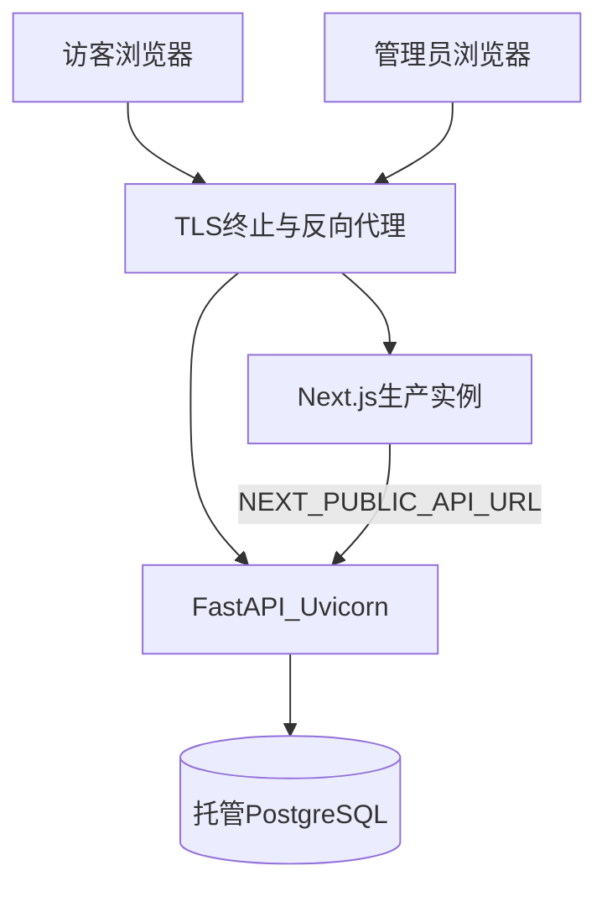

# 丝育教育官网（ArtPro）生产上线计划（执行参考）

| 项 | 内容 |
|----|------|
| 文档版本 | 0.1.0 |
| 最后更新 | 2026-04-28 |
| 关联 | [README.md](../README.md)、[艺考官网-需求说明.md](./艺考官网-需求说明.md)、[艺考官网-开发方案.md](./艺考官网-开发方案.md) |

> **用途**：上线前按章节勾选执行；云厂商细节由团队替换占位符。  
> **代码事实源**：环境变量见根目录 [`.env.example`](../.env.example)、[`apps/api/app/config.py`](../apps/api/app/config.py)；开发用 DB 见 [docker-compose.yml](../docker-compose.yml)（**不等于**生产拓扑）。

---

## 0. 上线前决策（填写后留档）

| 决策项 | 选项/结论 | 负责人 | 日期 |
|--------|-----------|--------|------|
| 云厂商与区域 | （例：阿里云华东 / AWS） | | |
| 部署模式 | VM+Nginx / 容器+LB / PaaS | | |
| 域名（官网） | | | |
| API 暴露方式 | 同域反代 / 独立子域 | | |
| 是否仅 HTTPS | 是 / 否 | | |
| 托管 Postgres 规格与备份策略 | | | |
| Staging 是否独立实例 | 是 / 否 | | |

---

## 1. 目标架构（逻辑）



要点：**生产勿用 SQLite**；`DATABASE_URL` / `DATABASE_URL_SYNC` 指向托管库；`CORS_ORIGINS` 仅含生产站点来源（含 `https`）。

---

## 2. 多环境定义（Staging 与 Prod）

| 环境 | 用途 | 数据 |
|------|------|------|
| **dev** | 本机 / Docker，日常开发 | 可 SQLite 或本地 Postgres |
| **staging** | 上线前验收，配置贴近生产 | **独立** Postgres；可灌脱敏数据 |
| **prod** | 真实用户 | 托管 Postgres；备份与访问控制按厂商最佳实践 |

约定：**迁移先在 staging 跑通**（`alembic upgrade head`），再在同一版本 tag 上部署 prod，最后对 prod 执行迁移（见第 6 节）。

---

## 3. 密钥与配置清单（生产必须核对）

在密钥管理（云 Secret / 环境注入）中维护，**不入库**：

| 变量 | 作用 | 注意 |
|------|------|------|
| `DATABASE_URL` | 异步 SQLAlchemy | `postgresql+asyncpg://...` |
| `DATABASE_URL_SYNC` | Alembic 迁移 | `postgresql+psycopg://...` |
| `ADMIN_JWT_SECRET` | 管理 JWT 签名 | **强随机、≥32 字节** |
| `ADMIN_USERNAME` / `ADMIN_PASSWORD_HASH` | 管理登录 | **生产改强密码**；仅存 bcrypt 哈希 |
| `CORS_ORIGINS` | 跨域 | 逗号分隔；**仅**实际 Origin（`https://...`） |
| `CORS_ALLOW_METHODS` / `CORS_ALLOW_HEADERS` | CORS 白名单 | 默认仅开放当前前端需要的动词与请求头；生产不要使用 `*` |
| `DEBUG` | 调试 | **生产 `0` / false** |
| `API_DOCS_ENABLED` | OpenAPI 文档 | 生产建议 **`false`**（关闭 `/docs`、`/redoc`、`/openapi.json`） |
| `LEADS_RATE_LIMIT` | 留资限流 | slowapi 格式，默认 `30/minute`；网关层仍可叠加 WAF |
| `ASSISTANT_RATE_LIMIT` | 咨询助手限流 | slowapi 格式；公开 SSE 路径必须叠加网关/WAF 防护 |
| `ARTICLE_REVISION_CLEANUP_ENABLED` | 文章修订清理 | 多 worker / 多实例部署建议设为 `false`，改用单独 cron 或 worker |

前端构建/运行时：

| 变量 | 作用 |
|------|------|
| `NEXT_PUBLIC_API_URL` | 浏览器请求的 API 基址；须 **HTTPS** 或与反代方案一致 |

---

## 4. 数据库与迁移（生产流程）

1. 在托管 Postgres **创建实例与用户**，网络仅允许 API 安全组访问。  
2. **首次**：在 CI 或跳板机 `cd apps/api` 执行 `alembic upgrade head`。  
3. **后续发版**：发布流程固定「含迁移时先 staging 验证，再 prod 执行迁移」。  
4. **备份**：自动备份 + 定期恢复演练。  
5. 从 dev SQLite **迁生产**需单独方案；不在本文展开。

---

## 5. 应用部署要点

### 5.1 API（`apps/api`）

- 依赖：`pip install -r requirements.txt`（生产建议 lock）。  
- **多 worker**（勿长期 `--reload`），示例：

```bash
cd apps/api
gunicorn app.main:app -k uvicorn.workers.UvicornWorker -w 4 -b 127.0.0.1:8000
```

- 健康检查：负载均衡探活 `GET /health/live`、就绪 `GET /health/ready`。  
- **限流**：应用层已对 `POST /api/v1/leads` 与 `POST /api/v1/assistant/chat` 按 IP 限流（slowapi）；slowapi 默认内存计数在多 worker / 多实例间不共享，生产必须在 **网关/WAF** 叠加共享限流，或改造为 Redis 等共享存储后再放大实例数。
- **后台任务**：文章修订清理默认随 API 进程启动。多 worker / 多实例会重复启动，生产建议关闭 `ARTICLE_REVISION_CLEANUP_ENABLED`，改由单独 cron/worker 触发。

### 5.2 Web（`apps/web`）

- `npm ci` → `npm run build` → `npm run start`（或平台托管）。  
- `NEXT_PUBLIC_*` 变更需 **重新 build**。  
- [`lib/api-server.ts`](../apps/web/lib/api-server.ts) 使用 `revalidate: 60`；紧急内容需理解缓存行为。

---

## 6. 发布顺序（降低事故概率）

1. 维护窗口（若需）。  
2. 部署 **API 新版本**（与当前 DB schema 兼容）。  
3. 执行 **Alembic**（仅当本版含迁移；staging 已验证）。  
4. 部署 **Web 新版本**。  
5. 验证：首页、资讯、留资、管理登录、`/health/ready`。  
6. **回滚**：保留上一版制品；DB 回滚需迁移可逆或团队规范。

---

## 7. 安全加固

- **限流**：应用层已覆盖公开留资；另可选 Nginx `limit_req`、云 WAF。  
- **依赖与镜像**：定期升级与 **CVE** 响应流程。  
- **管理端**：强密码、可选 IP 限制、`ADMIN_TOKEN_EXPIRES_MINUTES`；前端将 token 保存在 `localStorage` 并按后端过期时间清理，公网部署前需重点控制 XSS 面，后续可评估 HttpOnly Cookie 会话。
- **TLS**：全站 HTTPS。

---

## 8. CI/CD

- 仓库已提供 [`.github/workflows/ci.yml`](../.github/workflows/ci.yml)：`apps/api` 运行 `pytest`；`apps/web` 运行 `lint`、`test`、`build`。  
- 生产部署由平台触发；**密钥**仅存 CI Secret，不写日志。  
- 协作流程见 [CONTRIBUTING.md](../CONTRIBUTING.md)。

---

## 9. 可观测性与运维

- **日志**：stdout 集中收集；结构化；错误含堆栈。  
- **指标**：CPU、内存、5xx、延迟、DB 连接数。  
- **错误追踪**：可选 Sentry。  
- **告警**：`/health/ready` 连续失败、5xx 超阈。  
- **值班**：联系人、升级路径、回滚决策人。

---

## 10. 产品与法务（与开发衔接）

- **隐私政策 / 用户协议**：与 [LeadForm](../apps/web/components/LeadForm.tsx)、[`POST /api/v1/leads`](../apps/api/app/api/v1/leads.py) 收集字段一致；法务定稿后落地页面与页脚链接。  
- **ICP**：管理端站点配置 `icp` 与页脚展示真实备案信息。  
- **Cookie / 统计**：接分析脚本时按法规处理同意与披露。

---

## 11. 上线日 Checklist（可打印勾选）

- [ ] 托管 Postgres 就绪，5432 不对公网  
- [ ] 生产 `DATABASE_*`、`ADMIN_*`、`CORS_ORIGINS`、`DEBUG`、`API_DOCS_ENABLED` 已核对  
- [ ] `alembic upgrade head` 已在 staging 成功；prod 已执行（若本版含迁移）  
- [ ] API：gunicorn+workers + 反代 + HTTPS  
- [ ] Web：`build` + `start`，`NEXT_PUBLIC_API_URL` 正确  
- [ ] 手工验：首页、资讯、留资、管理登录、站点配置、健康检查  
- [ ] 网关限流/WAF（可选但推荐）  
- [ ] 备份与告警已开  
- [ ] 法务/备案文案已上线（若适用）

---

## 12. 上线后

- 监控 24～72 小时。  
- 记录变更与回滚；API 行为变更时同步 [需求说明附录 C](./艺考官网-需求说明.md#附录-c与当前仓库实现的状态对照)。

---

## 13. 修订记录

| 版本 | 日期 | 说明 |
|------|------|------|
| 0.1.0 | 2026-04-28 | 初稿入库；对齐 slowapi 留资限流、可选关闭 OpenAPI、gunicorn、GitHub Actions CI |
