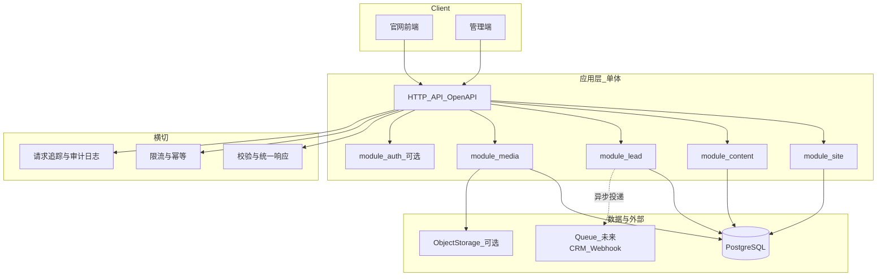

# 丝育教育官网 — 技术方案（开发向）

> 依据：[艺考官网-需求说明.md](./艺考官网-需求说明.md)（以下称「PRD」）。本文侧重**可扩展性、鲁棒性、实现上保持简洁高效**，不替代 PRD 中的产品决策。

## 1. 目标与原则

| 原则 | 含义 |
|------|------|
| **合同优先** | `/api/v1` 与统一响应包、错误码、分页等以 **OpenAPI 3** 为单一事实源；实现与联调均对合同负责，避免「口头 API」。 |
| **模块单体（Modular Monolith）** | 单一部署单元、一个主数据库、按**业务域**划分包/目录；在明确瓶颈前**不**拆微服务。 |
| **读多写少、写路径保守** | 公开展示以缓存与 CDNs 可优化；**留资、管理写操作**以校验、限流、审计为先。 |
| **边界清晰、依赖可替换** | 与 CRM、短信、对象存储的集成通过**小接口/适配器**进入领域层，业务规则不绑死在具体 SDK 上。 |
| **默认简单** | 能用一个中间件解决的不写框架；能显式表结构表达的不上事件溯源；YAGNI。 |

> **与仓库对齐**：本仓已落地 **方案 B**（`apps/api` 为 **FastAPI**，`apps/web` 为 **Next.js App Router**）。下列架构图为目标态；**当前代码级目录**见 §12 实现快照。

## 2. 总体架构



- **可扩展**体现在：新能力优先加**新模块**或**新路由组**，复用横切；对外仍是同一 `/api/v1` 与同一 OpenAPI。
- **鲁棒**体现在：横切层统一处理异常、限流、追踪；写路径有明确事务与失败语义。

## 3. 技术栈建议（择一并坚持）

以下给出两套「常见且文档化好」的组合，**二选一**即可满足 PRD 不绑框架 的前提；团队以 TypeScript 为主时优先 A，以 Python/现有仓库 venv 为主时优先 B。

| 层 | 方案 A（TS 全栈） | 方案 B（Python API + 前端） |
|----|-------------------|----------------------------|
| 官网与 SEO | **Next.js**（App Router，服务端组件做首屏 + Metadata） | **Next.js** 或 **Astro**（由静态/SSR 团队定） |
| API | **Next Route Handlers** 或同仓 **独立 Node 服务**（Hono / Express），统一挂在 `/api/v1` 后由反向代理 | **FastAPI**（Pydantic v2 校验、天然 OpenAPI） |
| 数据库 | **PostgreSQL** | 同左 |
| ORM/迁移 | **Drizzle** 或 **Prisma**（迁移可重复、类型清晰） | **SQLAlchemy 2** + **Alembic** |
| 管理端 | 同 Next 多路由 `/admin` 或独立子应用，共享同 API | 同左，对接 FastAPI |
| 对象存储 | 阿里云 OSS / 腾讯云 COS / S3 兼容，走预签名与回调登记（见 §6） | 同左 |

**本仓现状**：上表中 **方案 B 列** 已作为实际选型；ORM 为 **SQLAlchemy 2 + Alembic**；**尚无** 独立 `openapi/` 目录时以 FastAPI 生成的 OpenAPI 与 PRD 为准。对象存储、队列、CRM 同步等**未**开工；**最小管理端**（JWT 登录 + **预约信息（leads）**/站点/**文章管理** 全量 CRUD）与 **站点/文章落库** 已在仓库实现（见 §12）；公开 `POST /leads` 仍为访客留资入口。

**不推荐**在 v1 同时引入：多套 ORM、多套 API 风格、未约束的 BFF 链——会直接损害「简洁高效」。

## 4. 可扩展性设计

### 4.1 按域分包（与 PRD 模块对应）

与 PRD §5、§6.4 对齐，应用内建议目录/包一一映射，避免「大杂烩 `controllers`」：

- `site`：站点配置、banners、sections、`pages/{slug}`  
- `content`：articles、events、courses、teachers、showcases（可选）  
- `lead`：线索创建、列表、状态变更；未来 CRM 外拍由本域发起  
- `media`：元数据、与存储对接（上传策略二阶段可仅先用 URL 占位）  
- `auth`：管理端鉴权为必做；C 端会员为**可选包**，可独立开关  

新增「校区」或「多组织」时：在**数据模型**中预留可空外键或 `default_campus_id`，比事后拆表更便宜；API 层在 v1 可完全不暴露，直到产品决策（PRD 待办）。

### 4.2 版本与兼容

- URL 已含 `/api/v1`；**破坏性变更**用 **v2 路由并行**，旧 v1 保持一段时间。  
- 响应体在 `data` 内演进：新增字段**默认向后兼容**；删除/重命名走新版本或做适配层。  
- 与 GraphQL/tRPC 的关系遵守 PRD §6.5：若引入，维护 **REST 资源到查询的映射表**，避免两套真理。

### 4.3 对第三方集成的「端口」

- 定义**窄接口**（如 `NotificationPort.send_lead(lead_id)`、`CrmPort.sync(lead_id)`），实现类可为空、日志、或真实 HTTP。  
- 线索创建成功后，**可**写 outbox 表或发队列消息，再异步投递到 CRM，避免主请求依赖外部可用性。  
- 这样扩展「换 CRM / 加短信」时只换适配器，不扩散 `if` 到全站。

## 5. 鲁棒性设计

### 5.1 统一契约：响应、错误、HTTP 码

- **全站选一种**（建议在实现阶段定稿，与 PRD §6.1 二选一后写死代码）。  
- **实现建议**：4xx/5xx 表示 HTTP 语义错误与鉴权；**2xx 且 `code=0` 为业务成功**；业务可预期错误用非 0 `code` + 2xx，避免前端混用 `status` 与 `body.code`。或相反策略亦可，但**全站一个中间件**生成响应，禁止手搓 JSON。  
- 错误体包含：`code`、`message`、可选 `details`（字段级校验来自 OpenAPI/校验库）。  
- 错误码表按 PRD §6.3 落库为枚举或常量，**禁止**魔法数字遍布业务代码。

### 5.2 输入与输出

- 所有请求体/查询参 **Pydantic / Zod** 等**一次校验**，失败统一映射为 `100xxx` 类参数错误。  
- 列表 **pagination 二选一**（`page`+`pageSize` 或 `cursor`+`limit`）在 OpenAPI 里固定，避免每页手写。

### 5.3 高价值写路径：线索 `POST /leads`

- **限流**：对公网 IP + 可选 `fingerprint` / Cookie 做令牌桶；管理端可单独更严。  
- **幂等（可选 v1.1）**：支持 `Idempotency-Key` 头，重复提交返回同一结果，防重复网暴与家长误触双点。  
- **人机验证**：产品允许时接验证码或 Turnstile；无则强依赖限流 + 字段合理性校验。  
- **审计**：管理端对线索的查看、改状态打**结构化日志**（ who / when / lead_id ）。

### 5.4 管理端与鉴权

- 管理 API（PUT/POST/DELETE）**必须鉴权**；**最小权限**（仅站点编辑、仅线索阅读等可后续用 RBAC 扩展）。  
- 优先 **短寿命访问令牌**（如 JWT + refresh）或 **HttpOnly Session**；**禁止**把长期密钥放前端。  
- CORS 仅放开可信 admin 与官网 origin；生产**强制 HTTPS**（PRD §7）。

### 5.5 可观测性

- **Request-Id**（或 W3C `traceparent`）贯穿访问日志。  
- 健康检查：`/health/live`（进程）、`/health/ready`（连库）；编排与负载均衡使用 ready。  
- 业务指标：如 `leads_submitted_total`、`leads_submit_failed_total`（按原因标签），不替代日志但便于报警。

### 5.6 数据与事务

- 多表写操作**单事务**；与外部系统交互**不**与 DB 长事务锁在一起（用 outbox/队列）。  
- 并发编辑单页/文章：v1 可用「最后写入胜」+ `updated_at` 乐观锁；需冲突 UI 时再加版本号。

## 6. 媒体与文件（二阶段可简化）

- v0：**仅 URL 引用**（封面图、正文中图片），不入对象存储。  
- v1+：**预签名直传**到 OSS，后端只登记 `media` 元数据，符合 PRD §6.4.6，避免大文件压垮 API 机。  
- 删除媒体时**引用计数**或定期 GC，避免 404 脏链（规则与 PRD 定稿时同步）.

## 7. 与 OpenAPI 工作流

1. 在仓库维护 **`openapi/openapi.yaml`**（或分文件 `$ref` 合并）。  
2. CI：**lint**（Spectral 规则集）+ **破兼容性检测**（openapi-diff 对 main）。  
3. 由 OpenAPI 生成：服务端存根**或**仅生成 **TypeScript 客户端**给管理端/官网，减少漂移。  
4. 文档中「预留」的端点，在实现前即可标 `x-status: reserved`，实现后改为 `implemented`。

## 8. 目录结构示例（保持扁平）

**方案 A 示意**（Monorepo 根下）:

```
apps/
  web/                 # Next：官网 + 可选 admin
packages/
  api-contract/        # 仅 OpenAPI + 生成类型
  domain-site/
  domain-content/
  domain-lead/
  ...
```

**方案 B 示意**：

```
apps/api/              # FastAPI：路由按 router 分 domain
apps/web/              # 前端
openapi/
```

关键不是文件夹名字，而是 **domain 内聚、对外只经 HTTP 合同**，避免循环依赖（可用 lint 规则约束）。

## 9. 分阶段实施（与风险对冲）

| 阶段 | 范围 | 说明 |
|------|------|------|
| M0 | OpenAPI 草案 + 空壳路由 | 对齐全站响应包与错误表；可返回 mock。 |
| M1 | 公开只读 + 线索提交 | 优先冻结 **文章/师资/课程 GET** 与 **POST /leads**（PRD 风险点）。 |
| M2 | 管理端 + 写接口 | 鉴权、CSRF/同源策略、管理端表单。 |
| M3 | 媒体、异步 CRM | 存储与 outbox/队列。 |

**尽早冻结**：公开列表/详情的**字段**与 `POST /leads` 的**最小字段集**，减少前后端返工（PRD §8）。

## 10. 非功能与 PRD 的落地对应

| PRD §7 | 工程落地 |
|--------|----------|
| 可用性/SEO | 前端语义 HTML、LCP 资源控制、sitemap/robots 由框架或构建步骤产出。 |
| 安全 | 限流、HTTPS、敏感字段脱敏展示、依赖漏洞扫描（Dependabot 等）。 |
| 性能 | 列表加索引、N+1 用 join/批量查询、CDN 静态与缓存头；不先上过度缓存导致不一致。 |
| 可观测性 | §5.5 已述。 |

## 11. 待产品决策对工程的影响（PRD §8）

- **headless CMS**：若选 Strapi/Contentful，则本方案中的 `content` 域可**变薄**为代理与缓存，仍保留**自有 `leads` 与 `site` 若需**；需单独评估 SEO 与费用。  
- **多校区**：数据模型早预留外键，比上线后加列成本低。  
- **会员体系**：`auth` 包独立、功能开关，避免污染公开读路径。

---

## 12. 本仓库实现快照（与代码同步，维护时请更新本节）

> 产品对外品牌为 **丝育教育**；仓库与资源名可仍为 **ArtPro**（如 SQLite 文件、Postgres 用户等）。

### 12.1 单体与路由（`apps/api`）

- **入口**：`app/main.py` — 注册 `CORSMiddleware`、校验异常处理、`APIError` 统一 JSON 包、`/api/v1` 子路由、OpenAPI 路径 `/docs`、`/redoc`、`/openapi.json`。
- **v1 路由**（`app/api/v1/router.py` 聚合）：
  - `auth`：`POST /auth/login`（`app/api/v1/auth.py`）— 用户名密码 + bcrypt + JWT；环境变量 `ADMIN_JWT_SECRET`、`ADMIN_USERNAME`、`ADMIN_PASSWORD_HASH`。
  - `admin`（`app/api/v1/admin.py`，前缀 `/admin`，**须 Bearer**）：**预约信息** `GET/POST /admin/leads`，`GET/PUT/PATCH/DELETE /admin/leads/{id}`；`PUT /admin/site/config`；**文章** `GET/POST/PUT/DELETE /admin/articles` 与 `GET/PUT/DELETE /admin/articles/{id}` 等。
  - `site`：`GET /site/config`（`app/api/v1/site.py`）— 读 `site_config` 表（`get_or_create_row`），返回 `ok({ siteName, phone, address, icp })`。
  - `content`：`GET /articles` 分页列表（仅 `published_at` 已发布且到期时间前）；`GET /articles/{slug}` 单篇详情（公开，仅已发布）；`Article` 模型见 `app/models/article.py`。
  - `leads`：`POST /leads`（`app/api/v1/leads.py`）— `LeadCreate`，落库 `Lead`（含 `status` 默认 `new`），响应 `LeadOut`。
- **健康**：`GET /health/live`、`/health/ready`（连库检查）。
- **横切**：`app/core/responses.py` 提供 `ok` / `err`；`app/core/api_errors.py` 提供 `APIError`；`app/deps.py` 含 `get_current_admin`（JWT）；`422` 校验错误统一 JSON。
- **数据**：`app/db.py`；`app/models/`：`lead.py`、`site_config.py`、`article.py`；**Alembic** 迁移链 `0001`→`0002`（`leads.status`）→`0003`（`site_config` + `articles`）。默认 SQLite 于 `data/artpro.db`；可选用 **PostgreSQL**（根目录 `.env` 中 `DATABASE_URL` / `DATABASE_URL_SYNC`）与 [docker-compose.yml](../docker-compose.yml)、[scripts/postgres-docker-migrate.sh](../scripts/postgres-docker-migrate.sh)，见根 [README.md](../README.md)。
- **尚未按 PRD 落地**：`banners`、`pages`、`teachers`、`courses`、`events`、限流/人机验证（`leads` 上已标注后续中间件）、对象存储上传等。

### 12.2 前端（`apps/web`）

- **Next.js 15** App Router：`(site)/` 官网路由；`app/layout.tsx` 含 `AppProviders`（`ToastProvider`）、`fetchSiteConfig` 生成 `metadata`。
- **数据获取**：`lib/api-server.ts`（`server-only` + `cache`）：`fetchSiteConfig`、`fetchArticleList`、`fetchArticleBySlug` 等；`revalidate: 60`；`parseJsonEnvelope` 解析统一包。
- **客户端 API**：`lib/api.ts` 的 `getApiBase()` 供 `LeadForm`；`lib/adminApi.ts` 供管理端 `adminLogin` / `adminFetch`（Bearer + localStorage）、`emitAdminToast` 事件与 Toast 联动。
- **管理端 UI**：`app/(admin)/admin/`，`AdminAuthGate` / `AdminShell` / `AdminNav`（侧栏 **预约信息**、**站点**、**文章管理**）。预约：`/admin/leads`（列表、快捷 `PATCH` 状态、行内删）、`/admin/leads/new`、`/admin/leads/[id]`（表单 + 删）。文章：`/admin/articles`（列表行内删）、`/admin/articles/new`、`/admin/articles/[id]`；编辑含 `AdminArticleMdPreview`。
- **资讯页**：`news/page.tsx` 列表链到 `news/[slug]`；详情页用 `ArticleMarkdown`（`react-markdown` + `remark-gfm` + `rehype-sanitize`）+ Tailwind **typography** 插件。
- **UI 组件**：`SiteHeader` / `SiteFooter` / `LeadForm` 等；Tailwind，全局 `app/globals.css`。
- **测试**：Vitest + Testing Library；`npm run test`；`LeadForm` 测试需包一层 `ToastProvider`。
- **尚未落地**：机构/课程详情、自动化 `sitemap`/`robots`、PRD 其余只读资源（`teachers`、`events` 等）。

### 12.3 与 PRD §6.4 的对应

实现状态详见 [《艺考官网-需求说明》附录 C](./艺考官网-需求说明.md#附录-c与当前仓库实现的状态对照)（以 PRD 为合同，代码变更时请同步该表）。

### 12.3.1 生产上线

分阶段上线、密钥、迁移顺序、可观测性与法务核对等见 [《艺考官网-上线计划》](./艺考官网-上线计划.md)；CI 见仓库 [`.github/workflows/ci.yml`](../.github/workflows/ci.yml)。

### 12.4 OpenAPI 工作流（§7）

当前 **未** 在根目录维护独立 `openapi/openapi.yaml` 文件；合同以 **运行实例** 的 `GET /openapi.json` 与 PRD §6 为准。若引入 Spectral/CI 与版本化 `openapi/`，在合并首份 YAML 时更新本段与 [README 目录说明](../README.md)。

---

## 13. 修订记录

| 版本 | 日期 | 说明 |
|------|------|------|
| 0.1.0 | 2026-04-27 | 初稿：架构原则、可扩展/鲁棒要点、技术栈与阶段 |
| 0.1.1 | 2026-04-27 | 题头与品牌名「丝育教育」对齐；增加 §12 实现快照，与 `apps/api`、`apps/web` 代码对齐；标注方案 B 已采用 |
| 0.1.2 | 2026-04-27 | §12 对齐当前实现：管理端 JWT、站点/文章表、`GET/PUT` 与 `articles` 公开展示与详情、Markdown 前端、`.env` 自仓库根加载 |
| 0.1.3 | 2026-04-28 | §12：管理端 `leads` 全量 CRUD + `PATCH` 状态；UI 命名预约信息/文章管理；可选 Postgres 与迁移脚本说明；与 PRD 附录 C、README 同步 |
| 0.1.4 | 2026-04-28 | §12.3.1 [上线计划](./艺考官网-上线计划.md)；API 留资 slowapi 限流、可选 `API_DOCS_ENABLED`；GitHub Actions CI；gunicorn 依赖 |

**文档结束。**
