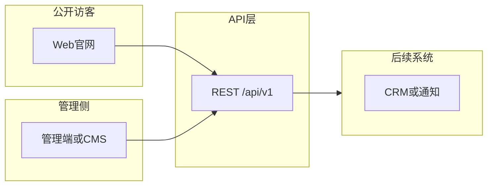

# 丝育教育官网 — 产品需求说明（PRD）

## 1. 文档信息

| 项 | 内容 |
|----|------|
| 文档名称 | 丝育教育官网产品需求说明（艺考类培训业务） |
| 版本 | 0.1.2 |
| 状态 | 草案 — 功能细节待定；公开/管理部分接口已在仓库中实现（见**附录 C**） |
| 最后更新 | 2026-04-27 |
| 作者 | （待填写） |
| 代码仓库 | 见根目录 [README.md](../README.md)（`apps/api` + `apps/web`） |

### 修订记录

| 版本 | 日期 | 说明 |
|------|------|------|
| 0.1.0 | 2026-04-27 | 初稿：背景、范围、模块与预留 REST 接口 |
| 0.1.1 | 2026-04-27 | 与当前实现对照：产品名**丝育教育**、增加附录 C（端点实现状态表） |
| 0.1.2 | 2026-04-27 | 附录 C 与 §6.4 说明对齐现状：`site`/`articles` 落库、按 `slug` 的公开详情、管理端鉴权与 CRUD、JWT 登录 |

---

## 2. 项目背景与目标

本网站服务于**丝育教育**等**艺术类高考（艺考）培训或相关服务机构**，面向考生与家长提供机构品牌形象、教学与成果信息、课程与活动动态，并支持**咨询留资**等转化路径；后续可扩展与教务、CRM、门店/多校区等系统对接。实现技术栈以仓库为准：当前为 **FastAPI + Next.js**（见 [开发方案](./艺考官网-开发方案.md) §12 实现快照），本版 PRD 仍**不**将具体字段与交互锁死在某一框架细节上。

**核心目标：**

- **品牌与信任**：展示机构定位、资质、师资与学员成果，建立第一印象。
- **信息触达**：发布新闻、活动、考季资讯等可运营内容。
- **线索转化**：通过表单/预约等收集意向，供销售或教务跟进（具体流程 TBD）。
- **可扩展**：通过统一 API 边界预留后台管理与多端（如小程序、App）复用可能。

---

## 3. 用户与角色

| 角色 | 说明 | 本阶段假设 |
|------|------|------------|
| 访客 | 未登录用户，浏览公开页面 | 主要服务对象 |
| 学员/家长 | 可能需账号的场景（如查看个人进度、报名记录） | **可选/预留** |
| 机构管理员 | 维护内容、处理线索、配置站点 | 可对应独立管理端或 headless CMS，鉴权 TBD |

权限模型（RBAC 细分、多角色）在具体功能确定后再补充。

---

## 4. 范围说明

### 4.1 第一阶段可能包含的官网能力（细节待定）

- 首页（聚合入口、重点模块、轮播/推荐位**占位**）
- 机构介绍、办学理念、环境展示（**占位**）
- 师资团队列表与详情（**占位**）
- 课程/班型/产品**概览**（非完整教务排课系统）
- 新闻资讯、活动通知、考季相关文章（**运营内容**）
- 学员作品或成绩展示（**可选模块**）
- 联系方式、地图、咨询入口；留资表单/预约（**核心转化，字段 TBD**）

### 4.2 明确不纳入 v1 或标为 TBD 的项（开放问题）

- 在线支付、完整订单与对账
- 完整教务（排课、点名、成绩录入系统）
- 与第三方 CRM/企微/短信的**具体对接方式与字段**
- 是否建设**学员端会员中心**、学习进度
- 多语言、多校区数据隔离规则
- 内容审核工作流、法务合规模板（用户协议/隐私政策文案）

以上项在需求定稿时逐一关闭或转二期。

---

## 5. 功能需求（模块级）

以下按模块描述**目标**；实现细节、字段与交互在评审后补入；与 **§7 预留接口** 对应。

| 模块 | 目标 | 与接口/备注 |
|------|------|-------------|
| 站点与首页区块 | 可配置轮播、推荐内容入口等 | `site`、`banners`、或聚合 `GET` |
| 机构与静态页 | 关于我们、环境等单页或富文本 | `pages` 或静态资源策略 TBD |
| 师资 | 列表、详情、对外展示 | `GET /teachers` |
| 课程/产品 | 班型/课程**对外介绍**，非排课核心 | `GET /courses`（或 `programs`） |
| 内容运营 | 文章、活动列表与详情、分类/标签 | `articles`、`events` |
| 成果/案例 | 作品或录取案例展示（若启用） | `showcases` |
| 线索与联系 | 表单提交、防刷、通知渠道 TBD | `POST /leads` |
| 媒体 | 图片/视频引用与上传（管理端） | `media`（可二期） |
| 账号与鉴权 | 管理端与可选 C 端用户 | `auth`（**可选/预留**） |

---

## 6. 预留接口设计

### 6.1 通用约定

- **Base path**：`/api/v1`（**版本化**，破坏性变更时递增 v2）。
- **风格**：**REST + JSON**，资源名使用**复数**英文化路径（如 `articles`、`teachers`），与中文产品文档对应关系在实现阶段固定。
- **Content-Type**：`application/json; charset=utf-8`。
- **成功响应**（建议统一包一层，具体字段名以 OpenAPI 为准）：

```json
{
  "code": 0,
  "message": "ok",
  "data": { }
}
```

- **业务错误**：`code` 为非 0；`message` 为人类可读说明；`data` 可含 `details`（校验错误列表等，TBD）。
- **HTTP 状态码**：2xx 表示传输层成功；业务失败是否仍返回 200 + `code`、或 4xx/5xx，由团队在实现时统一，本需求**预留两种策略**但需全站一致。

### 6.2 分页与筛选（占位）

- 列表类接口支持分页，建议二选一并全站统一：
  - **offset**：`page`（从 1 起）、`pageSize`
  - **游标**：`cursor`、`limit`
- 通用筛选：`q`（关键词）、`category`、`tag`、时间范围等，各资源在 Schema 中定义。

### 6.3 错误码区间（占位）

| 区间 | 含义 | 说明 |
|------|------|------|
| 0 | 成功 | — |
| 1xxxxx | 通用 | 参数错误、未授权、禁止访问等（细分 TBD） |
| 2xxxxx | 业务域 | 按模块划分（TBD） |
| 5xxxxx | 系统 | 内部错误、依赖超时等（TBD） |

### 6.4 端点总表（产品级目标；**当前实现见附录 C**）

下表为**产品/设计层**的 REST 草图，路径与认证方式在定稿前仍可能调整。仓库中**已落地**的端点、与下表的差异（例如管理接口使用 `/api/v1/admin/...`、文章公开详情按 **slug** 等）以 [**附录 C**](#附录-c与当前仓库实现的状态对照) 为准。

说明：`Auth` 表示调用方；**公开**=无需登录；**管理**=需管理端身份认证（**当前仓库**：管理 JWT 登录为 `POST /api/v1/auth/login`，受保护资源见附录 C）。管理端 `PUT/POST/DELETE` 在文档未定稿时仍可能继续列为表内路径或统迁至 `admin` 前缀。

#### 6.4.1 站点与页面部块

| 方法 | 路径 | 说明 | 认证 |
|------|------|------|------|
| GET | `/api/v1/site/config` | 站点级配置（站点名、联系信息、SEO 元数据等，字段 TBD） | 公开 |
| GET | `/api/v1/banners` | 轮播/焦点图列表 | 公开 |
| GET | `/api/v1/sections` | 首页/栏目区块配置（可选，或与 config 合并） | 公开 |
| PUT | `/api/v1/site/config` | 更新站点配置 | 管理 |
| PUT | `/api/v1/banners`、单资源 `/banners/{id}` | 轮播增删改 | 管理 |
| GET/PUT | `/api/v1/pages/{slug}` | 单页（关于我们、环境等，slug 标识） | 公开 GET；管理 PUT |

#### 6.4.2 文章与活动

| 方法 | 路径 | 说明 | 认证 |
|------|------|------|------|
| GET | `/api/v1/articles` | 文章列表（分页、筛选 TBD） | 公开 |
| GET | `/api/v1/articles/{id}` | 文章详情 | 公开 |
| POST/PUT/DELETE | `/api/v1/articles`、`/articles/{id}` | 管理文章 | 管理 |
| GET | `/api/v1/events` | 活动列表 | 公开 |
| GET | `/api/v1/events/{id}` | 活动详情 | 公开 |
| POST/PUT/DELETE | `/api/v1/events`、`/events/{id}` | 管理活动 | 管理 |

#### 6.4.3 课程与师资

| 方法 | 路径 | 说明 | 认证 |
|------|------|------|------|
| GET | `/api/v1/courses` | 课程/班型对外列表 | 公开 |
| GET | `/api/v1/courses/{id}` | 课程详情 | 公开 |
| POST/PUT/DELETE | `/api/v1/courses`… | 管理课程 | 管理 |
| GET | `/api/v1/teachers` | 师资列表 | 公开 |
| GET | `/api/v1/teachers/{id}` | 师资详情 | 公开 |
| POST/PUT/DELETE | `/api/v1/teachers`… | 管理师资 | 管理 |

#### 6.4.4 成果/案例（可选模块）

| 方法 | 路径 | 说明 | 认证 |
|------|------|------|------|
| GET | `/api/v1/showcases` | 案例/作品列表 | 公开 |
| GET | `/api/v1/showcases/{id}` | 详情 | 公开 |
| POST/PUT/DELETE | `/api/v1/showcases`… | 管理 | 管理 |

#### 6.4.5 线索与联系

| 方法 | 路径 | 说明 | 认证 |
|------|------|------|------|
| POST | `/api/v1/leads` | 提交咨询/预约/留言（防刷、字段 TBD） | 公开（限流） |
| GET | `/api/v1/leads` | 线索列表、筛选 | 管理 |
| GET/PATCH | `/api/v1/leads/{id}` | 单条查看、标记跟进状态 | 管理 |

> 若产品命名偏好「联系」可并存别名 `POST /api/v1/contact`，实现时**二选一**避免重复，本需求中保留为决策项。

#### 6.4.6 媒体资源

| 方法 | 路径 | 说明 | 认证 |
|------|------|------|------|
| POST | `/api/v1/media` | 上传（multipart 或直传后登记，TBD） | 管理或签名上传 |
| GET | `/api/v1/media/{id}` | 元数据 | 视策略 |
| DELETE | `/api/v1/media/{id}` | 删除 | 管理 |

#### 6.4.7 用户与鉴权（可选/预留）

| 方法 | 路径 | 说明 | 认证 |
|------|------|------|------|
| POST | `/api/v1/auth/register` | 注册（若启用 C 端账号） | 视策略 |
| POST | `/api/v1/auth/login` | 登录，返回 token 或 session | 视策略 |
| POST | `/api/v1/auth/logout` | 登出 | 已登录 |
| GET | `/api/v1/auth/me` | 当前用户 | 已登录 |
| POST | `/api/v1/auth/refresh` | 刷新令牌（若采用 JWT 双令牌） | 视策略 |

管理端可单独使用 `/api/v1/admin/auth/*` 或共用 `/auth` + 角色声明，**实现前决策**。

### 6.5 与 GraphQL / tRPC 等的关系

本需求以 **REST** 为默认描述方式，便于与常见 CMS、静态站点与小程序团队对齐。若后续统一采用 **GraphQL** 或 **tRPC**，应维护一份「**资源与查询/变更的对应表**」，避免与本文档中的资源边界脱节。

### 6.6 附录 A：JSON Schema 占位

以下仅列**可能**出现的实体名，**非最终字段**；定稿时以 **OpenAPI 3.x** 或独立 Schema 文件为准。

| 资源 | 候选字段（TBD） |
|------|-----------------|
| Article | `title`, `slug`, `excerpt`, `body`, `cover`, `category`, `tags`, `publishedAt`, `status` |
| Event | `title`, `startAt`, `endAt`, `location`, `body`, `registrationUrl?` |
| Course | `name`, `summary`, `duration`, `level`, `priceText?` |
| Teacher | `name`, `title`, `bio`, `avatar`, `order` |
| Lead | `name`, `phone`, `wechat?`, `message`, `source`, `createdAt` |
| SiteConfig | `siteName`, `icp?`, `address`, `phone`, `ogDefaults?` |

---

## 7. 非功能需求（简要）

| 类别 | 要求 |
|------|------|
| 可用性 | 关键信息可在首屏或二次点击内达到；需满足基本可读性与对比度（可细化 WCAG 等级目标）。 |
| SEO | 可配置每页 `title`/`description`；结构清晰 URL；站点的 `sitemap`/`robots` 策略 TBD。 |
| 安全 | 全站 HTTPS；管理端与表单接口**防刷/限流**；个人信息按最小必要收集与脱敏展示（法律条款 TBD）。 |
| 性能 | 首屏与列表接口有合理目标（如 LCP、TTFB，具体数值项目启动后再定）。 |
| 可观测性 | 预留日志、指标与关键业务事件（如线索提交成功/失败）埋点。 |

---

## 8. 假设、风险与待决策清单

**假设：**

- 机构具备合法办学或经营资质，网站展示内容经内部审核。

**风险：**

- 需求长期「待定」可能导致接口与前端反复修改；宜尽早冻结 **v0.1 公开读模型**与 **leads 提交字段**。

**待决策清单：**

- [ ] 管理端是自建还是对接 headless CMS  
- [ ] 线索是否同步 CRM、以何种方式通知（邮件/企微/短信）  
- [ ] 是否上线路索以外的 **会员/学习** 能力  
- [ ] 多校区/多城市是否在 v1 体现  

---

## 附录 B：系统关系示意（概念）



---

## 附录 C：与当前仓库实现的状态对照

> 下表与 **ArtPro** 仓库当前主分支代码一致；端点有变更时请**同步本表**并更新 [开发方案 §12](./艺考官网-开发方案.md#12-本仓库实现快照与代码同步维护时请更新本节)。

| PRD/路径（§6.4） | 状态 | 说明 |
|------------------|------|------|
| `GET /api/v1/site/config` | **已实现** | 读 `site_config` 表，首访插入默认行；`PUT` 为**管理端** `PUT /api/v1/admin/site/config`（需鉴权，不在 PRD 原表逐字列出，与「站点可配置」目标一致） |
| `GET /api/v1/articles` | **已实现** | 分页 `page`、`pageSize`；仅返回已发布；`items` 含 `id`、`title`、`slug`、`excerpt`、`publishedAt` |
| `GET /api/v1/articles/{slug}` | **已实现（细节路径）** | 公开单篇，按 **slug** 非 long id，返回正文等；用于官网 `/news/[slug]`。若 PRD 未来固定为 `/{id}`，可在网关或路由双注册兼容。 |
| `POST /api/v1/leads` | **已实现** | 写入 `leads`；含 `status` 默认 `new`；限流/人机验证待加 |
| `POST /api/v1/auth/login` 或等价管理登录 | **已实现** | JWT，环境变量配置管理员账号与 bcrypt 哈希；见仓库 `.env.example` |
| 管理 `GET/PATCH /api/v1/admin/leads` | **已实现** | 列表 + 状态更新 |
| 管理文章 CRUD `/api/v1/admin/articles` | **已实现** | 创建/读/改/删；`published_at` 为空为草稿、公开列表不展示 |
| `GET /health/live`、`/health/ready` | **已实现** | 不属于 `/api/v1` |
| `GET/PUT …/banners`、`/sections`、`/pages/{slug}` 等 | **未实现** | 与 §6.4.1 预留一致 |
| `/events*`、`/courses*`、`/teachers*` 等 | **未实现** | 与 §6.4.2–6.4.3 预留一致 |
| `*media*` 上传等 | **未实现** | 与 §6.4.6 预留一致；当前文章正文可为 Markdown，图可用外链 URL 文本 |

**前端与上述接口的对应关系**：`lib/api-server` 在服务端拉取 `site/config`、`articles`、单篇 by slug；`LeadForm` `POST` `leads`；**Next 管理端** `/admin/*` 使用 `lib/adminApi` 对接上述管理 API；资讯列表链至 `/news/[slug]`，正文以 Markdown 安全渲染（见开发方案 §12.2）。

---

**文档结束。**
